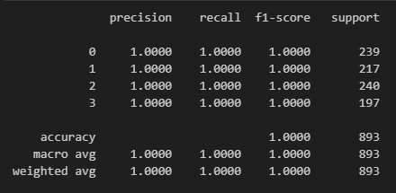

# Rice Leaf Disease Classification and Detection
By : Daffa Muhamad Azhar

## Dataset 
Rice Leaf Disease Image Samples from Mendeley : https://data.mendeley.com/datasets/fwcj7stb8r/1

The Dataset Consist of 4 Classes:
1. Bacterialblight : 1584 Images
2. Blast : 1440 Images
3. Brownspot : 1600 Images
4. Tungro : 1308 Images

The dataset is not imbalance so no need to oversampling or undersampling the dataset.


From the figure above, the Tungro class has different size than others.

## Classification

### Pre-Processing

Because of the Tungro's size, the class need to resized to `300x300 px`.

And the Image Restorastion used to restore image pixel caused of the motion when taking the picture or else. 


### Pre-Trained Model

On this project, ResNet50 from Keras is used as pre-trained model.

The Model Summary:


### Training Process

The Dataset is split into 70% training data, 15% validation data, and 15% test data.

On the training process, I used 15 epoch and 32 batch size.

```python
train_datagen = ImageDataGenerator()

train_generator = train_datagen.flow_from_directory(
        train_dir,
        target_size=(H, W),
        batch_size=64,
        class_mode='categorical',
        seed=42,
        )
```

```python
val_datagen = ImageDataGenerator()

val_generator = val_datagen.flow_from_directory(
        val_dir,
        target_size=(H, W),
        batch_size=64,
        class_mode='categorical',
        shuffle=False,
        )
```

```python
%%time

epochs = 15
batch_size = 32

history = resnet_model.fit(
  train_generator,
  validation_data=val_generator,
  batch_size=batch_size,
  epochs=epochs,
  verbose=1,
  callbacks=[early_stopping, model_save],
)
```


Training Result For ResNet50 Model:


Based on that graphic, it seems like overfit. But, let's check on the Evaluation.

### Evaluation

```python
test_datagen = ImageDataGenerator()

test_generator = test_datagen.flow_from_directory(
        test_dir,
        target_size=(H, W),
        batch_size=64,
        class_mode='categorical',
        shuffle=False,
        )
```

Prediction Result from ResNet50:



We can see that the model perfectly predict the test data.

At least for this Dataset.

## Detection

### Remove Background

I tried to remove the background so the focus is on the foreground. However, it has weaknesses. When the plant is the background itself, the plant will be removed and will detect nothing. And the remove background itself is not perfect so it will be some flaw.

On the other side, when the remove background goes well, the detection become better than without remove background.


### Thresholding

Need to find the threshold for the color for each disease. Every disease have different threshold color. After find the threshold, then use it for mask. Then find and draw the contours from that mask. It is kinda hard to find the best threshold for each disease.


## Streamlit Apps

I made streamlit apps for testing, and here is the results


